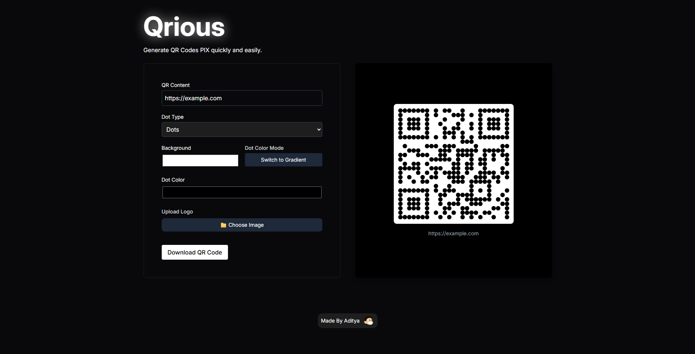

# Qrious

Qrious is a modern, customizable QR code generator built with React and Vite. Instantly create beautiful QR codes with custom colors, gradients, dot styles, and even your own logo. Download your QR code as a PNG for use anywhere.


## Features

- ⚡ **Instant QR Code Generation**: Enter any text or URL and see your QR code update in real time.
- 🎨 **Customizable Styles**: Choose dot shapes (square, dots, rounded, classy, etc.), background color, and dot color (solid or gradient).
- 🌈 **Gradient Presets**: Pick from beautiful gradient presets for your QR code dots.
- 🖼️ **Logo Support**: Upload your own logo to embed in the center of the QR code.
- ⬇️ **Download as PNG**: Save your QR code with a single click.
- 🖥️ **Responsive & Modern UI**: Built with Tailwind CSS for a sleek, dark-themed interface.

## Demo



## Getting Started

### Prerequisites

- [Node.js](https://nodejs.org/) (v16 or higher recommended)
- [npm](https://www.npmjs.com/) or [yarn]

### Installation

```bash
# Clone the repository
$ git clone https://github.com/adityabhatkar23/Qrious.git
$ cd Qrious

# Install dependencies
$ npm install
# or
yarn install
```

### Running Locally

```bash
# Start the development server
$ npm run dev
# or
yarn dev
```

Open [http://localhost:5173](http://localhost:5173) in your browser to use Qrious.

## Usage

1. **Enter Content**: Type a URL or any text in the QR Content field.
2. **Customize**: Select dot type, background color, and dot color mode (solid or gradient). If using gradient, pick a preset.
3. **Add Logo**: (Optional) Upload an image to embed in the QR code.
4. **Download**: Click "Download QR Code" to save your QR code as a PNG.

## Tech Stack

- [React 19](https://react.dev/)
- [Vite](https://vitejs.dev/)
- [Tailwind CSS](https://tailwindcss.com/)
- [qr-code-styling](https://github.com/kozakdenys/qr-code-styling)
- [motion](https://motion.dev/)
- [react-parallax-tilt](https://github.com/mkosir/react-parallax-tilt)

## Credits

- Made by [Aditya](https://adityabhatkar23.github.io/portfolio/)

## License

This project is open source and available under the [MIT License](LICENSE).
